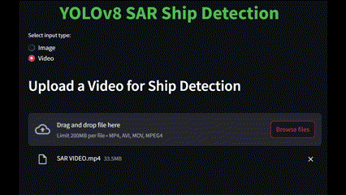

# SAR SHIP DETECTION USING YOLOv8

This project utilizes YOLOv8 for ship detection in Synthetic Aperture Radar (SAR) images and videos. The model detects ships from both images and video feeds uploaded by the user.

## 🚀 Features

- **Image Input**: Detects ships in uploaded images.
- **Video Input**: Detects ships in uploaded video files frame-by-frame.
- **Real-time Results**: Displays the number of detected ships in the current frame.

## 📸 Demo



## 🛠️ Requirements

- Python 3.8+
- Streamlit
- ultralytics (YOLOv8)
- OpenCV
- NumPy
- PIL

## 🚀 Installation

1. Clone the repository:
    ```bash
    git clone https://github.com/yourusername/sar-ship-detection.git
    ```

2. Navigate to the project folder:
    ```bash
    cd sar-ship-detection
    ```

3. Install the required dependencies:
    ```bash
    pip install -r requirements.txt
    ```

4. Run the app:
    ```bash
    streamlit run app.py
    ```

## 📝 Usage

1. **Run the app** using Streamlit:
    ```bash
    streamlit run app.py
    ```

2. **Select input type**: Choose between image or video upload.
3. **Upload your image/video** and see real-time ship detection results.

## ⚙️ Model Details

The model used in this project is YOLOv8, a state-of-the-art object detection model, trained to detect ships in SAR images.

### Steps:
- The model uses **YOLOv8** architecture.
- Inference is done frame-by-frame for videos, and object detection results are plotted on the image/video.
- Ships detected in the image/video are highlighted, and the total number of ships is displayed.

## 🔧 Customization

You can retrain the model using your own dataset by modifying the training script (located in the `weights/` folder). Ensure that the dataset is preprocessed correctly to achieve optimal results.

---
